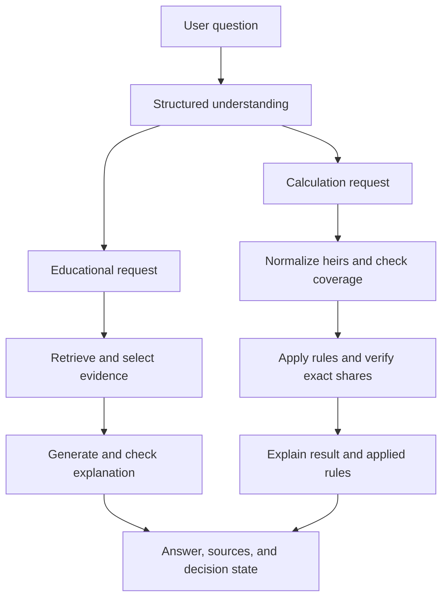

# MAWARITH AI

**Understand the case. Verify the calculation. Explain with evidence.**

MAWARITH AI is an Arabic-first platform for learning Islamic inheritance and solving supported inheritance cases. It supports **Arabic and English**, with RTL/LTR interfaces, structured learning paths, contextual tutors, and source-grounded explanations.

The system separates language understanding from inheritance rule selection and arithmetic. The LLM interprets questions and explains selected evidence or verified results. A deterministic rule engine determines final shares using exact fractions. Missing information triggers clarification; unsupported calculations stop with a specialist referral.

## Contents

- [What the platform does](#what-the-platform-does)
- [Quick start](#quick-start)
- [Configuration reference](#configuration-reference)
- [How it works](#how-it-works)
- [Calculation scope](#calculation-scope)
- [Sources and retrieval](#sources-and-retrieval)
- [API and decision states](#api-and-decision-states)
- [Docker and deployment](#docker-and-deployment)
- [Validation](#validation)
- [Troubleshooting](#troubleshooting)
- [Repository map](#repository-map)
- [Limitations and source policy](#limitations-and-source-policy)

## What the platform does

| Capability | User experience |
| --- | --- |
| Bilingual interaction | Arabic and English questions, explanations, and interface layouts. |
| Guided learning | Seven concept lessons, four learning paths, and four calculation teaching paths. |
| Contextual tutoring | Educational definitions, comparisons, and help within learning pages. |
| Case understanding | Extracts relatives and relationships from natural-language descriptions. |
| Exact calculation | Applies implemented rules and verifies supported distributions using rational arithmetic. |
| Evidence presentation | Shows source excerpts and references separately from the generated explanation and applied rules. |
| Clarification and referral | Asks for consequential missing information or explains why a final distribution is unavailable. |
| Session continuity | Restores drafts, completed answers, and meaningful errors within the browser session; supports retry, cancellation, and duplicate-submit protection. |

Teaching a concept does not imply that its calculation rule is implemented. For example, **awl and radd are covered educationally, but automatic allocation for them is not implemented**.

## Quick start

Run backend commands from the repository root. The commands below use **Windows PowerShell** and call the virtual environment's Python directly, so activation is unnecessary.

### 1. Prepare the project

Prerequisites:

- Python 3.13, matching the backend Docker image.
- Node.js 20.9 or newer and npm.
- Either configured cloud services, or local Ollama/Qdrant with approved source artifacts.
- Docker only if running a local Qdrant container or the backend image.

```powershell
git clone https://github.com/xAGS1/mawarith-ai.git
Set-Location mawarith-ai

py -3.13 -m venv .venv
.\.venv\Scripts\python.exe -m pip install -r requirements.txt
if (!(Test-Path .env)) { Copy-Item .env.example .env }
```

A fresh checkout does **not** include the full demonstration corpus. An empty Qdrant instance is not enough for evidence-backed retrieval.

### 2. Choose a runtime profile

The backend can run locally while calling cloud services, or use local models and sources. Edit the root `.env` with one of these configurations.

#### Profile A: Cloud services

Use Fanar for understanding/explanation, Cloudflare for query embeddings, and an existing populated Qdrant Cloud database. This profile avoids loading BGE-M3 into backend memory.

```dotenv
LLM_PROVIDER=fanar
LLM_FALLBACK_PROVIDER=none
FANAR_API_KEY=YOUR_FANAR_API_KEY
FANAR_BASE_URL=https://api.fanar.qa/v1
FANAR_MODEL=Fanar-C-2-27B

SOURCE_MODE=cloud
EMBEDDING_PROVIDER=cloudflare
QDRANT_HOST=https://YOUR_QDRANT_CLUSTER.cloud.qdrant.io
QDRANT_API_KEY=YOUR_QDRANT_API_KEY
FIQH_COLLECTION=mawarith_fiqh
FIQH_EMBEDDING_MODEL=BAAI/bge-m3

CLOUDFLARE_ACCOUNT_ID=YOUR_CLOUDFLARE_ACCOUNT_ID
CLOUDFLARE_API_TOKEN=YOUR_WORKERS_AI_TOKEN
CLOUDFLARE_EMBEDDING_MODEL=@cf/baai/bge-m3
```

Replace placeholders with credentials issued by each service. The Qdrant collections must already contain approved evidence, compatible vectors, and the payload indexes required by retrieval. See [Sources and retrieval](#sources-and-retrieval).

#### Profile B: Local services

Install the optional embedding/source dependencies and prepare Ollama:

```powershell
.\.venv\Scripts\python.exe -m pip install -r requirements-fiqh.txt
ollama pull qwen3:8b
```

Ensure Ollama is running. Use `ollama serve` only if its service is not already active.

If you do not already have Qdrant, start a persistent local instance:

```powershell
docker run -d --name mawarith-qdrant -p 6333:6333 -v mawarith-qdrant-storage:/qdrant/storage qdrant/qdrant
```

Configure `.env`:

```dotenv
LLM_PROVIDER=ollama
LLM_FALLBACK_PROVIDER=none
OLLAMA_HOST=http://127.0.0.1:11434
OLLAMA_MODEL=qwen3:8b

SOURCE_MODE=local
EMBEDDING_PROVIDER=local
QDRANT_HOST=http://localhost:6333
QDRANT_API_KEY=
FIQH_COLLECTION=mawarith_fiqh
FIQH_EMBEDDING_MODEL=BAAI/bge-m3
FIQH_EMBEDDING_BATCH_SIZE=32
```

Approved local artifacts and indexing are separate requirements. Do not rebuild or replace a working collection just to start the app. Source tooling includes `backend.rag.rebuild_uqu`, `backend.rag.dorar_ingestion`, and modules under `backend/rag/fiqh/`; inspect their options and source metadata before ingestion.

### 3. Start the backend

```powershell
.\.venv\Scripts\python.exe -m uvicorn backend.app:app --host 127.0.0.1 --port 8000
```

FastAPI loads the root `.env` at startup without overriding existing process environment variables. Restart the backend after configuration changes. Standalone scripts may have different environment-loading behavior.

In another terminal, check the backend:

```powershell
Invoke-RestMethod http://127.0.0.1:8000/health
Invoke-RestMethod http://127.0.0.1:8000/ready
```

`/health` confirms liveness. `/ready` checks selected dependencies and can return HTTP 503; it is not a complete end-to-end test. See [Readiness checks](#readiness-checks).

### 4. Start the frontend

In a separate terminal:

```powershell
Set-Location frontend
npm.cmd ci
if (!(Test-Path .env.local)) { Copy-Item .env.example .env.local }
```

Set `frontend/.env.local` to:

```dotenv
BACKEND_API_URL=http://127.0.0.1:8000
```

Then run:

```powershell
npm.cmd run dev
```

Open [http://localhost:3000](http://localhost:3000). API documentation is at [http://127.0.0.1:8000/docs](http://127.0.0.1:8000/docs).

On Linux/macOS, use `npm` instead of `npm.cmd` and the corresponding virtual-environment Python path.

### 5. Try a request

Educational example:

```json
{"mode": "learn", "question": "ما معنى العصبة؟"}
```

Supported calculation example:

```json
{"mode": "case", "question": "مات وترك زوجة وابنين"}
```

Send these through the interface or `POST /ask`. Check the decision state, source references, and any displayed fractions.

## Configuration reference

Credentials belong on the **backend**. The frontend needs only `BACKEND_API_URL`; it is a service address, not an API secret, and does not need a `NEXT_PUBLIC_` prefix.

| Variable | Default or purpose |
| --- | --- |
| `LLM_PROVIDER` | Code default: `ollama`; `.env.example` selects `fanar`. Set explicitly. |
| `LLM_FALLBACK_PROVIDER` | `none`; set `ollama` only when deliberate local fallback is configured. |
| `FANAR_API_KEY` | Fanar credential. Backend secret. |
| `FANAR_BASE_URL` | `https://api.fanar.qa/v1` |
| `FANAR_MODEL` | `Fanar-C-2-27B` |
| `OLLAMA_HOST` | `http://127.0.0.1:11434` |
| `OLLAMA_MODEL` | `qwen3:8b` |
| `SOURCE_MODE` | `local` or `cloud`; default `local`. |
| `EMBEDDING_PROVIDER` | `local` or `cloudflare`; default `local`. |
| `QDRANT_HOST` | `http://localhost:6333` locally; use the cluster URL for cloud access. |
| `QDRANT_API_KEY` | Empty for the local example; required for authenticated cloud access. Backend secret. |
| `FIQH_COLLECTION` | `mawarith_fiqh` |
| `FIQH_EMBEDDING_MODEL` | `BAAI/bge-m3`; identifies the indexed vector model. |
| `FIQH_EMBEDDING_BATCH_SIZE` | `32` |
| `CLOUDFLARE_ACCOUNT_ID` | Account used for Workers AI embeddings. |
| `CLOUDFLARE_API_TOKEN` | Workers AI credential. Backend secret. |
| `CLOUDFLARE_EMBEDDING_MODEL` | `@cf/baai/bge-m3` |
| `PORT` | Backend container port; default `8000`. |
| `BACKEND_API_URL` | Frontend server-side proxy destination; default `http://127.0.0.1:8000`. |

`SOURCE_MODE` and `EMBEDDING_PROVIDER` are independent. Switching query embedding providers does not reindex documents and may change retrieval rankings.

## How it works

The browser calls Next.js `/api/ask`, which proxies to FastAPI `/ask`. Structured language understanding determines whether the request is educational or a calculation.



| Component | Responsibility |
| --- | --- |
| Next.js + TypeScript | Bilingual interface, learning pages, session state, and API proxy. |
| FastAPI + Python | Request orchestration, structured responses, and backend services. |
| Fanar-C-2-27B | Language understanding and explanation using MAWARITH-selected evidence. |
| Ollama / Qwen3-8B | Optional local LLM transport. |
| BGE-M3 | Dense embeddings for semantic retrieval, locally or through Workers AI. |
| Qdrant | Vector retrieval with source metadata and filters. |
| Rule engine + `fractions.Fraction` | Implemented inheritance rules, exact allocation, verification, and rule traces. |

Fanar receives evidence selected by MAWARITH; Fanar-Sadiq and external Fanar retrieval are not used. Fallback is disabled by default.

Post-generation safeguards depend on the actual provider. Fanar generations retain hard and claim/grounding checks but bypass the strict lexical/near-verbatim support gate; Ollama generations retain stricter sentence screening. These safeguards detect bounded classes of errors and can shorten or withhold an explanation, but do not prove semantic correctness.

Backend LLM generation is limited to **two concurrent requests per process**; additional calls queue. Retrieval and deterministic arithmetic are outside this limiter.

## Calculation scope

Final shares use `fractions.Fraction`, not floating-point arithmetic. Percentages are presentation values. Supported fixed shares are allocated first, then the supported residuary family receives the actual remainder.

### Supported examples

These examples assume fully stated cases within the implemented scope. Additional relatives or circumstances require another coverage check.

| Case | Per-person shares |
| --- | --- |
| One son | Son: `1` |
| Two sons | Each son: `1/2` |
| Three sons | Each son: `1/3` |
| Son and daughter | Son: `2/3`; daughter: `1/3` |
| Two sons and two daughters | Each son: `1/3`; each daughter: `1/6` |
| Wife and two sons | Wife: `1/8`; each son: `7/16` |
| Wife, son, and daughter | Wife: `1/8`; son: `7/12`; daughter: `7/24` |

Direct sons share the residue equally. Sons and daughters share it with individual weights of **2:1**. Daughters without sons use the existing fixed-share rules, rather than the direct-children residuary family.

### Coverage boundaries

- Existing fixed-share and limited full-sibling rules apply only where coverage is complete. Full sibling, grandfather, uncle, and distant-residuary coverage is not implemented.
- Automatic **awl/radd** allocation is not implemented. Unsupported residue and competing residuary classes lead to referral.
- **Umariyyat** remains guarded; the engine does not silently apply the ordinary mother's one-third-of-estate rule.
- Ambiguous sibling subtypes or unspecified child counts require clarification.
- Presence and eligibility are distinct. Features are computed before exclusion; a blocked relative is not automatically absent from every case feature.
- Descendants through daughters are not silently treated as descendants through sons; their calculation remains unsupported.

For example, a wife-only case can identify a supported fixed share but still refer because the remainder-allocation policy is unsupported. A partial calculation is not displayed as a completed distribution.

Solver `rule_trace` entries record rule/category IDs, affected heirs, exact fractions, relevant input residue, and available source IDs. See [Quran-based rule data](data/sources/inheritance_rules.json) and [local solver evidence](backend/rules/solver_sources.json).

**Arithmetic consistency does not establish complete fiqh correctness.** A distribution must satisfy the implemented coverage checks as well as the fraction checks.

## Sources and retrieval

| Source | Use in the system |
| --- | --- |
| Quran evidence | Approved passages and references for supported inheritance rules, including An-Nisa 4:11, 4:12, and 4:176. |
| Kuwaiti Fiqh Encyclopedia | Educational evidence and bounded local solver evidence for residuaries and exclusion. |
| Umm Al-Qura University Mawarith course | Educational concepts and explanations. |
| Dorar Fiqh Encyclopedia | Inheritance-book material for educational retrieval. |
| Approved educational references | Reviewed material available through the installed local artifacts or indexed payloads. |

Exact source excerpts remain separate from reviewed summaries and generated explanations. References preserve available attribution, locations, qualifications, and links. A retrieved example does not authorize a new executable rule.

### Runtime modes

| Setting | Behavior |
| --- | --- |
| `SOURCE_MODE=local` | Uses approved local artifacts and source adapters. Full corpora are not bundled in Git. |
| `SOURCE_MODE=cloud` | Reads evidence from existing Qdrant payloads without requiring raw/processed local corpora at runtime. Curated backend rule/source JSON remains required. |
| `EMBEDDING_PROVIDER=local` | Loads BGE-M3 through Sentence Transformers, using CUDA when available or CPU otherwise. Requires optional dependencies. |
| `EMBEDDING_PROVIDER=cloudflare` | Requests BGE-M3 embeddings through Cloudflare Workers AI without loading the model into backend memory. |

Retrieval expects **1024-dimensional dense vectors with Cosine distance**. Source availability depends on approved artifacts or indexed payloads; neither mode guarantees full concept coverage. Cloud Quran retrieval requires suitable indexed Quran payloads.

### Collection expectations and payload indexes

The current readiness code checks these exact collection counts:

| Collection | Expected points |
| --- | ---: |
| `mawarith_fiqh` | 1,767 |
| `mawarith_uqu` | 47 |

These are implementation expectations, not a fresh measurement of a live cluster. `FIQH_COLLECTION` configures fiqh retrieval; the UQU educational path uses `mawarith_uqu`. Readiness still checks the two fixed collection names above.

Qdrant strict-mode filtering can require payload indexes for the fields actually queried:

| Fields | Index type |
| --- | --- |
| `verified_source` | Boolean |
| `embedding_model`, `source_id`, `source_type`, `source_name`, `publisher`, `section`, `topic` | Keyword |
| `volume`, when used in filtering | Integer |

A missing index can cause HTTP 400 even when vectors and point counts are correct. `/ready` does not validate payload indexes or run full retrieval.

## API and decision states

| Endpoint | Purpose |
| --- | --- |
| `GET /health` | Cheap process liveness; returns `{"status":"ok"}` without dependency checks. |
| `GET /ready` | Dependency readiness; returns HTTP 200 or 503. |
| `POST /ask` | Educational/case orchestration and answer presentation. |
| `POST /analyze-case` | Structured case analysis. |
| `GET /learn/concepts` | Concept catalog and individual concept routes. |
| `GET /learn/paths` | Learning-path catalog and individual path routes. |
| `GET /learn/examples` | Example catalog and individual example routes. |
| `GET /docs` | Interactive FastAPI documentation. |

`mode` accepts `learn` or `case` and defaults to `learn`. Semantic understanding determines the actual request type; compatibility mode does not unconditionally override contradictory question text. Optional educational `concept_context` contains bounded `slug` and `title` strings and supplies context, not evidence.

Responses include `decision_state`, `answer`, `sources`, `source_excerpts`, `limitations`, and relevant clarification/case fields. Educational responses also use `evidence_status`.

| Decision state | Meaning |
| --- | --- |
| `ready` | A supported educational answer or verified calculation is available. |
| `needs_clarification` | A consequential detail is missing or ambiguous. |
| `specialist_referral` | The calculation cannot provide a supported final distribution. |
| `out_of_scope` | The request is outside the current supported scope. |

Clarification follows the query's language. Known referral reasons are explained deterministically. Educational evidence insufficiency is presented as “تعذر تقديم شرح موثق”, rather than a calculation referral. Public responses omit private retrieval diagnostics and local source paths.

### Readiness checks

`GET /ready` checks:

- Fanar configuration, or Ollama reachability and model availability, depending on the selected provider.
- Cloud source configuration when `SOURCE_MODE=cloud`.
- Qdrant reachability, fixed collection counts, and 1024/Cosine vector configuration.
- An actual embedding probe and vector validation.

For Fanar, this verifies **configuration, not API-key validity or successful generation**. Different legitimate collection counts still fail the current fixed-count check. Each readiness request runs an embedding probe, which can incur remote usage/latency or load a local model.

Use `/health` for inexpensive liveness. Test fresh `/ask` requests separately to validate the complete path.

## Docker and deployment

### Backend image

The root [Dockerfile](Dockerfile) uses Python 3.13 slim, installs `requirements.txt`, copies `backend/` and curated `data/sources/`, and runs Uvicorn as a non-root user. It excludes local fiqh corpora, local embedding dependencies, Quran cache files, and `.env` files.

Use the **cloud source and embedding profile** with the supplied image:

```powershell
docker build -t mawarith-backend .
docker run --rm --env-file .env -e SOURCE_MODE=cloud -e EMBEDDING_PROVIDER=cloudflare -e PORT=8000 -p 8000:8000 mawarith-backend
```

Supply credentials at runtime. Changing the port requires changing both `PORT` and the container port mapping. Container localhost does not refer to the host's Ollama service.

### Railway backend

1. Deploy from the root Dockerfile.
2. Configure Fanar, Cloudflare, and Qdrant credentials; set `SOURCE_MODE=cloud` and `EMBEDDING_PROVIDER=cloudflare`.
3. Keep the supplied start command, which binds `0.0.0.0` and uses the injected `PORT`.
4. Set `/ready` as the deployment healthcheck and allow time for dependency calls; use `/health` for separate liveness monitoring.
5. Verify payload indexes and fresh educational, calculation, clarification, and referral requests before judging.

### Vercel frontend

1. Import the repository with `frontend` as the project root.
2. Use Next.js and the repository's build script.
3. Set `BACKEND_API_URL` to the backend HTTPS base URL in each intended environment.
4. Redeploy after environment changes and verify a fresh request through `/api/ask`.

The Next.js proxy uses a **120-second backend timeout**. Hosted platform limits can impose an earlier limit. Backend secrets remain on the backend service.

These instructions describe deployment configuration; they do not certify that a hosted instance is currently healthy.

## Validation

### Backend

Run regressions from the repository root in a separate test terminal. `httpx` is needed by FastAPI `TestClient` and is not currently listed in `requirements.txt`.

```powershell
.\.venv\Scripts\python.exe -m pip install httpx

$env:LLM_PROVIDER = "ollama"
$env:LLM_FALLBACK_PROVIDER = "none"
$env:SOURCE_MODE = "local"
$env:EMBEDDING_PROVIDER = "local"

.\.venv\Scripts\python.exe -X utf8 -m pytest tests -q -p no:cacheprovider --tb=short
.\.venv\Scripts\python.exe -m compileall -q backend tests
```

Close the test terminal afterward so its overrides do not affect normal startup or cloud smoke tests. Tests use fixtures and mock external calls where applicable; they do not establish live service readiness.

### Frontend

From `frontend/` after installing npm dependencies:

```powershell
npm.cmd run typecheck
npm.cmd run build
npx.cmd playwright install chromium
$env:PLAYWRIGHT_CHANNEL = "chromium"
npm.cmd run test:e2e
```

Browser tests use a fixture backend and a built frontend by default, covering desktop/mobile flows. They do not validate live Fanar or Qdrant. There is no `npm test` or frontend lint script; use the listed scripts.

The suites cover exact allocation, readiness/referral guards, source integrity, provider policies, clarification language, reference deduplication, session restoration, and cross-page requests. Manual evaluation tools are under `evaluation/`; inspect their options before making paid service requests. Historical reports and pass counts describe their own runs, not current validation.

## Troubleshooting

| Symptom | Check |
| --- | --- |
| `/health` succeeds but `/ready` returns 503 | Read the returned check flags. Confirm provider configuration, Qdrant collection expectations, and embedding availability. |
| Qdrant retrieval returns HTTP 400 | Check payload indexes on the collection queried, not only point counts. |
| Fanar is configured but answers fail | Readiness does not authenticate the key. Verify provider credentials and a fresh generation request. |
| Local startup has no source evidence | Full corpora are not in Git. Confirm approved source artifacts and populated collections. |
| Cloud answers lack a source | Confirm the required source payloads are indexed; collection counts do not guarantee coverage. |
| Frontend cannot reach the backend | Check `BACKEND_API_URL`, backend reachability, and the server-side proxy request. Restart/redeploy after changes. |
| Local embeddings fail to load | Install `requirements-fiqh.txt`; the first model load may require a download. |
| Backend tests fail importing `httpx` | Install the documented test prerequisite in the virtual environment. |
| Docker cannot reach host-local Ollama | Container localhost is separate from the host. Configure an accessible service address. |

## Repository map

| Path | Responsibility |
| --- | --- |
| `backend/app.py`, `backend/readiness.py` | API and dependency checks. |
| `backend/llm/` | Provider transports, understanding, explanation, and generation capacity. |
| `backend/pipeline/` | Orchestration and answer safeguards. |
| `backend/parsing/` | Relationship extraction and normalization. |
| `backend/rules/` | Case readiness, exclusions, fixed shares, and supported residuaries. |
| `backend/verifier/` | Fraction verification. |
| `backend/rag/` | Evidence retrieval, source modes, and source preparation. |
| `backend/learning/`, `backend/sources/` | Learning catalogs, reviewed evidence, and exact-source adapters. |
| `backend/schemas/` | Structured API and result models. |
| `data/sources/` | Curated metadata and rule/source JSON. |
| `data/fiqh/` | Local source artifacts; raw/processed corpora are git-ignored. |
| `frontend/src/`, `frontend/tests/` | Interface and browser regressions. |
| `tests/`, `evaluation/` | Backend regressions and manual evaluation tools. |

## Scope and future expansion

MAWARITH AI currently relies on a selected set of approved Islamic inheritance sources.

The main path for expanding the platform is to incorporate a broader range of trusted fiqh references and structured source material. This will allow MAWARITH AI to cover more inheritance cases, explanations, and educational scenarios while preserving the same source-grounded approach.

The system architecture is already designed to support this growth, so future development will focus primarily on expanding and enriching the verified source base.
