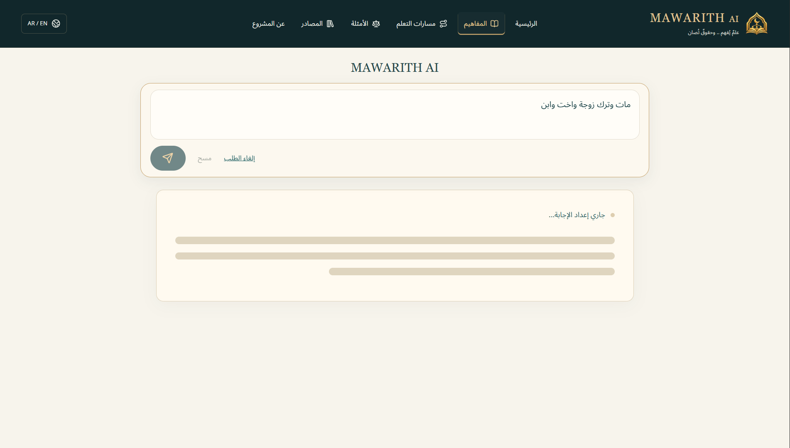
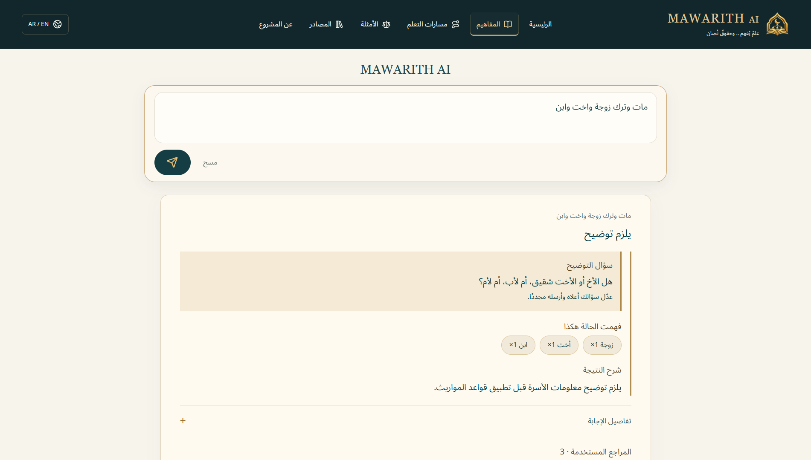
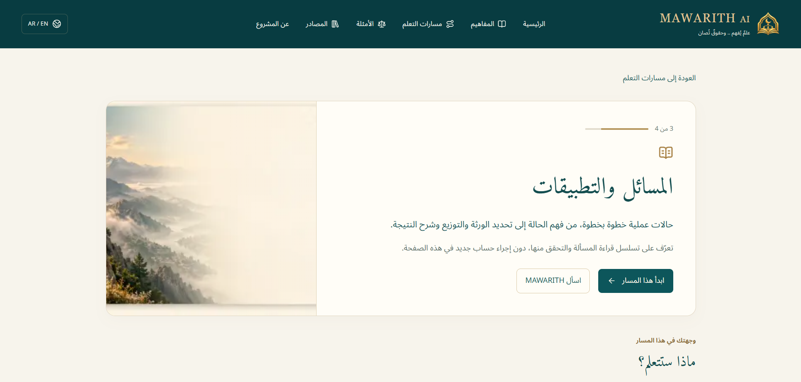
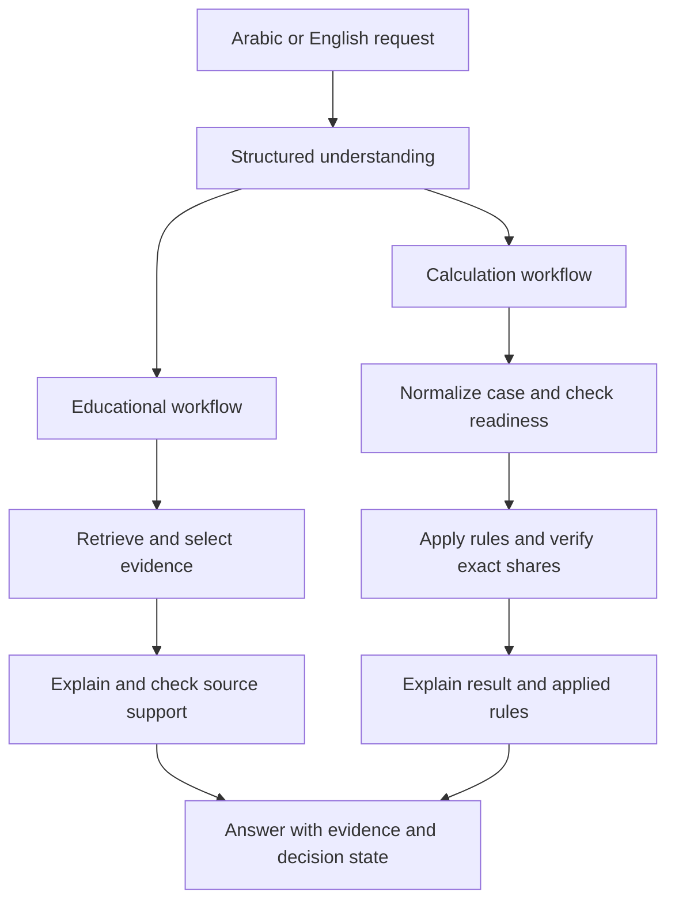

# MAWARITH AI

### Understand the case. Verify the calculation. Explain with evidence.

**MAWARITH AI** brings Islamic inheritance learning, natural-language case understanding, and source-grounded explanations into one bilingual experience. Arabic is the primary language, with English support and layouts adapted to both RTL and LTR reading.

The platform is built around a clear engineering principle: **language understanding, source evidence, and inheritance arithmetic have separate responsibilities**. An LLM interprets the request and explains the evidence or verified result. A deterministic rule engine selects implemented inheritance rules, calculates exact shares, and records how the result was produced.

## Product preview

<p align="center">
  
  
</p>

<p align="center">
  
  
</p>

<p align="center">
  
</p>

## Why MAWARITH AI

Inheritance questions connect family relationships, conditional rules, and precise arithmetic. A useful answer should help the user understand the case, follow the calculation, and inspect the supporting references.

MAWARITH AI connects these needs in a single workflow:

- **Learn the concepts** through structured lessons and contextual tutoring.
- **Describe a case naturally** in Arabic or English.
- **Review the interpreted relatives and relationships** before relying on the result.
- **Understand the distribution** through exact shares and applied-rule details.
- **Explore the evidence** through source excerpts and reference metadata.

## Product experience

| Feature | What it delivers |
| --- | --- |
| Arabic and English | Bilingual interaction and interface layouts with RTL/LTR support. |
| Guided learning | Seven concept lessons, four learning paths, and four calculation teaching paths. |
| Contextual tutors | Definitions, comparisons, and explanations connected to the learning page. |
| Natural-language cases | Structured extraction of relatives, relationships, and case features. |
| Exact inheritance arithmetic | Rational calculations with fixed shares assigned before residuary distribution. |
| Source-grounded explanations | Evidence excerpts, reference summaries, and applied rules presented separately. |
| Clarification | Targeted questions when a consequential detail is missing or ambiguous. |
| Session continuity | Drafts and completed answers restored within the browser session, with cancellation, retry, and duplicate-submit protection. |

## How it works

The frontend sends requests through a Next.js server-side proxy to FastAPI. Structured understanding routes each request into an educational or calculation workflow.



### Educational workflow

Relevant material is retrieved from approved sources using BGE-M3 embeddings, Qdrant, and source-specific retrieval paths. Selected evidence is passed to the LLM, followed by provider-specific explanation checks. The user can open the original excerpts and available reference details.

### Calculation workflow

Extracted relationships are normalized into structured case features. The backend checks case readiness and rule coverage, applies fixed shares and the relevant implemented residuary rules, and verifies the calculation using Python's `fractions.Fraction`.

The result includes an applied-rule trace with identifiers, affected heirs, exact fractions, relevant residue values, and available source references. Requests that need additional information or review receive an explicit decision state.

**Knowledge and calculation grow together through reviewed references, explicit rule families, and regression coverage.**

## Engineering foundations

| Design choice | Engineering value |
| --- | --- |
| Separate understanding and calculation | Final shares are determined by executable rules rather than generated arithmetic. |
| Exact rational arithmetic | Preserves fraction values throughout allocation and verification. |
| Structured request and response models | Connects extraction, calculation, evidence, and interface presentation through explicit contracts. |
| Traceable sources and rules | Keeps source text, generated explanation, and calculation provenance distinct. |
| Modular providers | Supports Fanar and local Ollama, with explicit provider configuration. |
| Independent source and embedding modes | Allows local and cloud retrieval configurations without coupling them to the LLM transport. |
| Session-aware frontend | Maintains request ownership and restores useful state across client-side navigation. |
| Containerized backend | Provides a non-root runtime with environment-based configuration. |

## Technology stack

| Layer | Technology | Role |
| --- | --- | --- |
| Interface | Next.js, React, TypeScript | Learning pages, tutors, bilingual layouts, and session state. |
| API | FastAPI, Python, Pydantic | Request orchestration and structured results. |
| Language model | Fanar-C-2-27B | Language understanding and evidence-based explanation. |
| Local model option | Ollama, Qwen3-8B | Alternative local LLM transport. |
| Embeddings | BGE-M3 | Semantic representation of questions and source passages. |
| Cloud embeddings | Cloudflare Workers AI | BGE-M3 query embeddings without loading the model into application-server memory. |
| Vector retrieval | Qdrant | Dense vector search and source metadata filtering. |
| Calculation | Rule engine, `fractions.Fraction` | Rule execution, exact allocation, and verification. |
| Deployment | Docker, Railway, Vercel | Backend container and separate frontend/backend hosting. |
| Validation | pytest, TypeScript checks, Playwright | Backend regressions and desktop/mobile interface tests. |

Fanar receives evidence selected by MAWARITH, keeping the retrieval and explanation layers under the application's orchestration.

## Sources and evidence

| Reference | Role in MAWARITH AI |
| --- | --- |
| Quran evidence, including An-Nisa 4:11, 4:12, and 4:176 | References for implemented inheritance rules and approved Quran evidence. |
| Kuwaiti Fiqh Encyclopedia | Educational retrieval and bounded source evidence for calculation rules. |
| Umm Al-Qura University Mawarith course | Inheritance concepts and educational explanations. |
| Dorar Fiqh Encyclopedia, inheritance book | Educational retrieval of inheritance material. |
| Approved educational references | Reviewed material connected through local artifacts or indexed payloads. |

Original source excerpts remain separate from reviewed summaries and generated explanations. References retain available source names, attribution, locations, and links.

Calculation provenance can be inspected in [Quran-based rule data](data/sources/inheritance_rules.json) and [solver evidence](backend/rules/solver_sources.json).

## Example calculation

**Input:** `مات وترك زوجة وابنين وبنت`

For this case:

| Heir | Per-person share | Allocation |
| --- | --- | --- |
| Wife | `1/8` | Fixed share with descendants. |
| Each son | `7/20` | Two units of the residue. |
| Daughter | `7/40` | One unit of the residue. |

**Fraction check:** `1/8 + 7/20 + 7/20 + 7/40 = 1`

Fixed shares are applied first. The remaining `7/8` is distributed between the two sons and one daughter using individual weights of **2:2:1**. The interface connects the interpreted case, distribution, explanation, and references.

## Run the project

### Requirements

- Python 3.13.
- Node.js 20.9 or newer and npm.
- Configured LLM, embedding, and retrieval services.
- Approved source material available through local artifacts or populated Qdrant collections.

The following commands use **Windows PowerShell**. On Linux/macOS, use the corresponding virtual-environment Python path and `npm` in place of `npm.cmd`.

### 1. Install the backend

```powershell
git clone https://github.com/xAGS1/mawarith-ai.git
Set-Location mawarith-ai

py -3.13 -m venv .venv
.\.venv\Scripts\python.exe -m pip install -r requirements.txt
if (!(Test-Path .env)) { Copy-Item .env.example .env }
```

### 2. Configure services

Edit the root `.env`. For the cloud-services profile:

```dotenv
LLM_PROVIDER=fanar
LLM_FALLBACK_PROVIDER=none
FANAR_API_KEY=YOUR_FANAR_API_KEY
FANAR_BASE_URL=https://api.fanar.qa/v1
FANAR_MODEL=Fanar-C-2-27B

SOURCE_MODE=cloud
EMBEDDING_PROVIDER=cloudflare
QDRANT_HOST=https://YOUR_QDRANT_CLUSTER.cloud.qdrant.io
QDRANT_API_KEY=YOUR_QDRANT_API_KEY
FIQH_COLLECTION=mawarith_fiqh
FIQH_EMBEDDING_MODEL=BAAI/bge-m3

CLOUDFLARE_ACCOUNT_ID=YOUR_CLOUDFLARE_ACCOUNT_ID
CLOUDFLARE_API_TOKEN=YOUR_WORKERS_AI_TOKEN
CLOUDFLARE_EMBEDDING_MODEL=@cf/baai/bge-m3
```

Connect the approved source collections using **1024-dimensional BGE-M3 vectors with Cosine distance** and the payload indexes used by retrieval.

<details>
<summary><strong>Local model and embedding configuration</strong></summary>

Install the optional dependencies and prepare the model:

```powershell
.\.venv\Scripts\python.exe -m pip install -r requirements-fiqh.txt
ollama pull qwen3:8b
```

Ensure Ollama is running. If a new local Qdrant instance is needed:

```powershell
docker run -d --name mawarith-qdrant -p 6333:6333 -v mawarith-qdrant-storage:/qdrant/storage qdrant/qdrant
```

Use these `.env` values with approved local source artifacts and populated collections:

```dotenv
LLM_PROVIDER=ollama
LLM_FALLBACK_PROVIDER=none
OLLAMA_HOST=http://127.0.0.1:11434
OLLAMA_MODEL=qwen3:8b

SOURCE_MODE=local
EMBEDDING_PROVIDER=local
QDRANT_HOST=http://localhost:6333
QDRANT_API_KEY=
FIQH_COLLECTION=mawarith_fiqh
FIQH_EMBEDDING_MODEL=BAAI/bge-m3
FIQH_EMBEDDING_BATCH_SIZE=32
```

Source preparation tools are under `backend/rag/`. Inspect their options and source metadata before ingestion or indexing.

</details>

### 3. Start the backend

```powershell
.\.venv\Scripts\python.exe -m uvicorn backend.app:app --host 127.0.0.1 --port 8000
```

FastAPI loads the root `.env` without overriding existing process environment variables. Restart after configuration changes.

### 4. Start the frontend

In another terminal, from the repository root:

```powershell
Set-Location frontend
npm.cmd ci
if (!(Test-Path .env.local)) { Copy-Item .env.example .env.local }
```

Set `frontend/.env.local`:

```dotenv
BACKEND_API_URL=http://127.0.0.1:8000
```

Then run:

```powershell
npm.cmd run dev
```

Open [localhost:3000](http://localhost:3000). Backend API documentation is at [127.0.0.1:8000/docs](http://127.0.0.1:8000/docs).

## API

| Endpoint | Purpose |
| --- | --- |
| `POST /ask` | Educational and case requests. |
| `POST /analyze-case` | Structured case analysis. |
| `GET /learn/concepts` | Concept catalog and individual concept routes. |
| `GET /learn/paths` | Learning-path catalog and individual path routes. |
| `GET /learn/examples` | Example catalog and individual example routes. |
| `GET /health` | Lightweight process liveness. |
| `GET /ready` | Configured dependency readiness. |
| `GET /docs` | Interactive API documentation. |

Example request to `POST /ask`:

```json
{
  "mode": "case",
  "question": "مات وترك زوجة وابنين"
}
```

Use `mode: "learn"` for educational requests. The understanding layer also evaluates the semantic intent of the question.

Responses connect the answer with `decision_state`, `sources`, `source_excerpts`, and relevant case or clarification fields.

| State | Role |
| --- | --- |
| `ready` | Presents a supported educational answer or verified calculation. |
| `needs_clarification` | Requests a consequential missing or ambiguous detail. |
| `specialist_referral` | Directs a case requiring further review to a specialist. |
| `out_of_scope` | Identifies requests outside the current application scope. |

## Deployment

The frontend and backend are deployed separately. Next.js proxies browser requests to FastAPI, keeping service credentials on the backend.

**Backend:** Deploy the root Dockerfile to Railway with the cloud-services environment variables. The container runs as a non-root user, binds to `0.0.0.0`, and uses the injected `PORT`.

**Frontend:** Deploy `frontend/` to Vercel as a Next.js project and set `BACKEND_API_URL` to the backend HTTPS address.

Build and run the backend container locally:

```powershell
docker build -t mawarith-backend .
docker run --rm --env-file .env -e SOURCE_MODE=cloud -e EMBEDDING_PROVIDER=cloudflare -e PORT=8000 -p 8000:8000 mawarith-backend
```

Verify dependency readiness through `/ready`, then exercise representative requests through the frontend. `/health` provides inexpensive liveness checks.

## Validation

MAWARITH AI is validated across backend logic, source/rule behavior, and the frontend experience.

- **470 backend tests passed**
- **78 focused source/rule tests passed**
- **Desktop & mobile E2E tested**

Backend regressions cover exact fraction allocation, rule behavior, case readiness, source integrity, provider policies, and clarification. Frontend tests cover reference presentation, session restoration, cross-page requests, and desktop/mobile flows.

### Backend checks

From the repository root, use a dedicated test terminal:

```powershell
.\.venv\Scripts\python.exe -m pip install httpx

$env:LLM_PROVIDER = "ollama"
$env:LLM_FALLBACK_PROVIDER = "none"
$env:SOURCE_MODE = "local"
$env:EMBEDDING_PROVIDER = "local"

.\.venv\Scripts\python.exe -X utf8 -m pytest tests -q -p no:cacheprovider --tb=short
.\.venv\Scripts\python.exe -m compileall -q backend tests
```

Close the test terminal afterward to keep these overrides separate from normal startup.

### Frontend checks

From `frontend/`, after installing dependencies:

```powershell
npm.cmd run typecheck
npm.cmd run build
npx.cmd playwright install chromium
$env:PLAYWRIGHT_CHANNEL = "chromium"
npm.cmd run test:e2e
```

Automated tests use fixtures and mocked services where applicable. Live-provider and retrieval evaluations are available separately under `evaluation/`.

## Repository structure

| Directory | Responsibility |
| --- | --- |
| `backend/llm/` | Understanding, explanation, model transports, and generation capacity. |
| `backend/parsing/`, `backend/schemas/` | Relationship normalization and structured contracts. |
| `backend/pipeline/` | Request orchestration and explanation safeguards. |
| `backend/rules/`, `backend/verifier/` | Rule execution, allocation, and exact verification. |
| `backend/rag/`, `backend/sources/` | Evidence retrieval, source preparation, and exact-source adapters. |
| `backend/learning/` | Educational catalogs and reviewed learning material. |
| `data/sources/` | Curated rule data and source metadata. |
| `frontend/src/` | Interface, learning experience, session state, and API proxy. |
| `tests/`, `frontend/tests/` | Backend and browser regression suites. |
| `evaluation/` | Evaluation tools and run-specific artifacts. |

## Scope and future expansion

MAWARITH AI is developed incrementally around reviewed sources, explicit rule families, and reproducible checks. Clarification, exact verification, and traceable rule execution are built into the user experience.

The next development priorities are:

- Broader trusted inheritance references and richer educational evidence.
- Deeper bilingual lessons and guided case explanations.

The modular architecture allows the knowledge base, learning experience, and calculation engine to grow independently while preserving traceable results.

## Configuration and source attribution

Keep Fanar, Qdrant, and Cloudflare credentials on the backend. Use placeholders in `.env.example`, keep `.env` out of Git, and supply deployment credentials through runtime environment variables.

Source excerpts retain attribution and available reference metadata. Full source corpora are managed separately; original access and licensing terms govern their use and redistribution.
